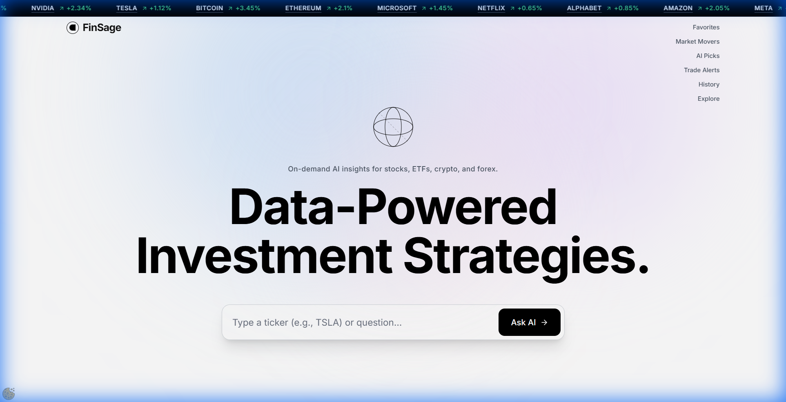
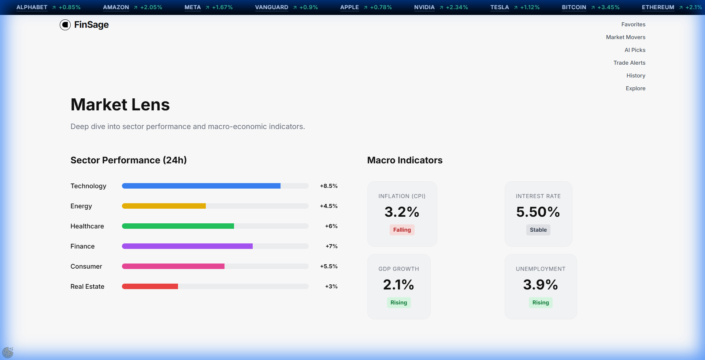
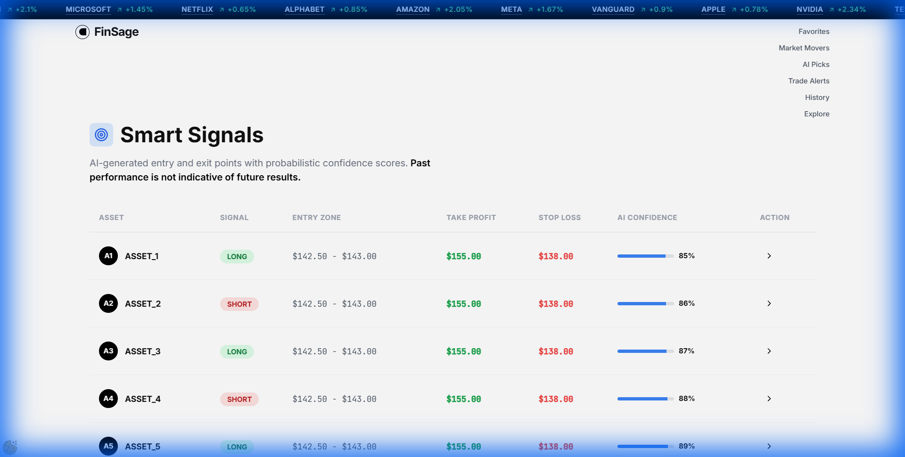
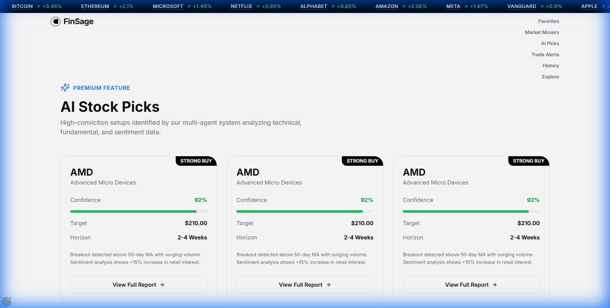
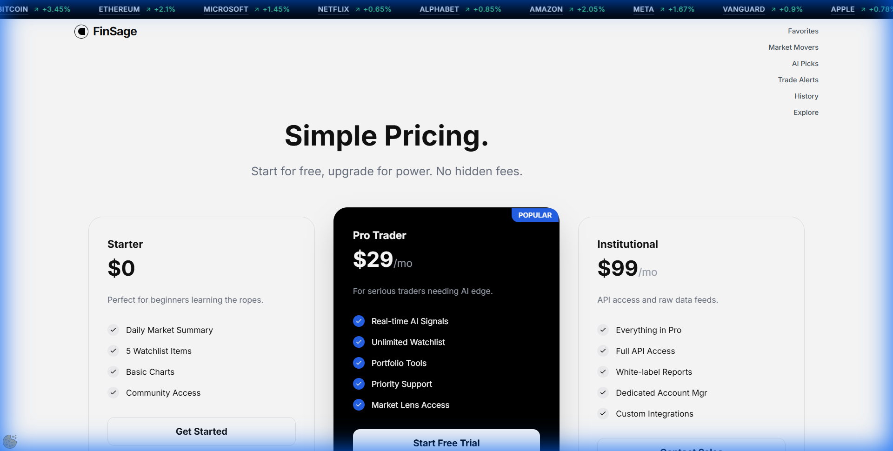

<div align="center">

# 🧠 FinSage AI

### **Data-Powered Investment Strategies with Artificial Intelligence**

[](https://reactjs.org/)
[](https://www.typescriptlang.org/)
[](https://vitejs.dev/)
[](https://tailwindcss.com/)
[](https://ai.google.dev/)

<p align="center">
  <strong>AI-powered financial analysis platform providing real-time market insights, smart signals, and data-driven investment recommendations.</strong>
</p>

<p align="center">
  <a href="#-features">Features</a> •
  <a href="#-pages-overview">Pages</a> •
  <a href="#-tech-stack">Tech Stack</a> •
  <a href="#-quick-start">Quick Start</a> •
  <a href="#-api">API</a> •
  <a href="#-license">License</a>
</p>

---



</div>

## ✨ Features

### 🤖 AI-Powered Analysis

- **InvestGPT** - Conversational AI interface powered by Google Gemini 1.5 Pro for deep market analysis
- **AI Picks** - Machine learning-driven stock recommendations with confidence scores
- **Smart Signals** - AI-generated entry and exit points with probabilistic confidence metrics

### 📊 Market Intelligence

- **Market Lens** - Real-time sector performance and macro-economic indicators
- **Market Movers** - Track top gainers, losers, and volume leaders
- **Trade Alerts** - Customizable notifications for price movements and technical signals

### 📈 Portfolio Tools

- **Favorites** - Watchlist management for tracking preferred assets
- **History** - Complete analysis history and portfolio performance tracking
- **Explore** - Discover new investment opportunities across asset classes

### 🎓 Education & Resources

- **Academy** - Comprehensive learning resources for traders of all levels
- **Podcast** - Weekly market insights and expert interviews
- **API Access** - Developer-friendly endpoints for custom integrations

---

## 📸 Pages Overview

FinSage AI includes **18 fully-designed pages** covering all aspects of investment analysis:

<table>
<tr>
<td width="50%">

### 🏠 Core Pages

| Page          | Description                                           |
| ------------- | ----------------------------------------------------- |
| **Home**      | Landing page with hero section and AI query interface |
| **InvestGPT** | AI chat interface for stock analysis                  |
| **Explore**   | Browse and discover investment opportunities          |
| **Favorites** | Personal watchlist management                         |
| **History**   | Analysis and trading history                          |

</td>
<td width="50%">

### 📊 Market Data

| Page              | Description                             |
| ----------------- | --------------------------------------- |
| **Market Movers** | Top gainers, losers, and volume leaders |
| **Market Lens**   | Sector performance & macro indicators   |
| **Smart Signals** | AI-generated trading signals            |
| **AI Picks**      | ML-powered stock recommendations        |
| **Trade Alerts**  | Custom price and signal notifications   |

</td>
</tr>
</table>

<table>
<tr>
<td width="50%">

### 🛠️ Tools & Resources

| Page        | Description                           |
| ----------- | ------------------------------------- |
| **Tools**   | Financial calculators and utilities   |
| **Academy** | Educational courses and tutorials     |
| **Podcast** | Audio content and market commentary   |
| **API**     | Developer documentation and endpoints |

</td>
<td width="50%">

### 💼 Business & Legal

| Page          | Description                      |
| ------------- | -------------------------------- |
| **Pricing**   | Subscription plans and features  |
| **Affiliate** | Partner program information      |
| **Privacy**   | Privacy policy and data handling |
| **Terms**     | Terms of service and usage       |

</td>
</tr>
</table>

---

## 📷 Screenshots

<details>
<summary><b>🏠 Home Page - Hero Section</b></summary>


_Landing page featuring the AI query interface and key features overview._

</details>

<details>
<summary><b>📊 Market Lens - Dashboard</b></summary>



_Real-time sector performance analysis with macro-economic indicators including inflation, interest rates, GDP growth, and unemployment data._

</details>

<details>
<summary><b>🎯 Smart Signals</b></summary>



_AI-generated trading signals with entry zones, take profit targets, stop loss levels, and AI confidence scores._

</details>

<details>
<summary><b>🤖 AI Picks</b></summary>



_Machine learning-powered stock recommendations with detailed analysis._

</details>

<details>
<summary><b>💰 Pricing</b></summary>



_Subscription tiers with feature comparisons and value propositions._

</details>

---

## 🛠️ Tech Stack

### Frontend

| Technology         | Purpose                                |
| ------------------ | -------------------------------------- |
| **React 19.2**     | Core UI framework with latest features |
| **TypeScript 5.0** | Type-safe development                  |
| **Vite 7.3**       | Next-generation build tool             |
| **Tailwind CSS**   | Utility-first styling                  |
| **Framer Motion**  | Smooth animations and transitions      |
| **React Router 7** | Client-side navigation                 |

### AI & Data

| Technology                | Purpose                             |
| ------------------------- | ----------------------------------- |
| **Google Gemini 1.5 Pro** | Advanced AI analysis and chat       |
| **Marked**                | Markdown rendering for AI responses |
| **Lucide React**          | Modern icon library                 |

### Architecture

```
finsage-ai/
├── components/          # Reusable UI components
│   ├── Hero.tsx         # Main hero section with AI input
│   ├── Navbar.tsx       # Navigation bar
│   ├── Footer.tsx       # Site footer
│   ├── Ticker.tsx       # Live stock ticker
│   ├── Layout.tsx       # Page layout wrapper
│   ├── ScrollReveal.tsx # Scroll animation component
│   └── ...
├── pages/               # Application pages (18 total)
│   ├── Home.tsx
│   ├── InvestGPT.tsx
│   ├── MarketLens.tsx
│   ├── SmartSignals.tsx
│   └── ...
├── services/            # Business logic and data
│   ├── geminiService.ts # AI integration
│   └── data/            # Mock data and templates
├── media/               # Screenshots and assets
├── App.tsx              # Main application router
└── index.tsx            # Application entry point
```

---

## 🚀 Quick Start

### Prerequisites

- **Node.js** 18.0 or higher
- **npm** or **yarn** package manager

### Installation

```bash
# Clone the repository
git clone https://github.com/yourusername/finsage-ai.git

# Navigate to project directory
cd finsage-ai

# Install dependencies
npm install
```

### Configuration

1. Create or edit `.env.local` file in the root directory:

```env
GEMINI_API_KEY=your_gemini_api_key_here
```

2. Get your Gemini API key from [Google AI Studio](https://aistudio.google.com/)

### Running the Application

```bash
# Development mode (with hot reload)
npm run dev

# Production preview
npm run preview

# Build for production
npm run build
```

The application will be available at `http://localhost:5173` (dev) or `http://localhost:4173` (preview).

---

## 🔌 API Integration

FinSage AI uses Google Gemini 1.5 Pro for AI-powered analysis. The service includes:

### Available Endpoints (via Gemini)

| Feature                | Description                                 |
| ---------------------- | ------------------------------------------- |
| **Stock Analysis**     | Comprehensive analysis of individual stocks |
| **Market Trends**      | Sector and macro-economic analysis          |
| **Portfolio Insights** | Personalized portfolio recommendations      |
| **News Summary**       | AI-summarized financial news                |

### Example Query

```typescript
// Ask about any stock or market
const response = await geminiService.analyze("Analyze TSLA stock performance");
```

### Response Format

The AI provides structured responses including:

- **Technical Analysis** - Chart patterns, support/resistance levels
- **Fundamental Analysis** - Financial metrics, valuation ratios
- **Sentiment Analysis** - Market sentiment and news impact
- **Risk Assessment** - Volatility and risk metrics
- **Recommendations** - Buy/sell/hold suggestions with confidence

---

## 📊 Data Sources

FinSage AI includes comprehensive mock data for demonstration:

- **Stocks Data** - Real-world stock information for major exchanges
- **Crypto Data** - Cryptocurrency market data
- **News Templates** - Financial news and analysis templates
- **Response Templates** - Pre-built AI response formats

---

## 🎨 Design System

### Colors

| Color      | Hex       | Usage           |
| ---------- | --------- | --------------- |
| Brand Dark | `#0a0a0a` | Backgrounds     |
| Brand Blue | `#4361ee` | Primary actions |
| Brand Pink | `#f72585` | Accents         |
| Brand Cyan | `#4cc9f0` | Highlights      |

### Typography

- **Primary**: Inter (weights: 300-800)
- **Monospace**: JetBrains Mono (code blocks)

### Animation

- Framer Motion for smooth page transitions
- Custom marquee animation for stock ticker
- Scroll-reveal effects for content sections

---

## 📁 Media Assets

All screenshots and demo assets are stored in the `./media/` folder:

| File                   | Description                     |
| ---------------------- | ------------------------------- |
| `home.png`             | Home page hero section          |
| `market-lens.png`      | Market Lens dashboard           |
| `smart-signals.png`    | Smart Signals trading interface |
| `ai-picks.png`         | AI Picks recommendations        |
| `pricing.png`          | Subscription pricing page       |
| `invest-gpt.png`       | InvestGPT chat interface        |
| `app-walkthrough.webp` | Full app walkthrough video      |

---

## 🔒 Legal

### Privacy Policy

User data is handled according to our [Privacy Policy](/#/privacy). We do not sell personal information to third parties.

### Terms of Service

By using FinSage AI, you agree to our [Terms of Service](/#/terms).

### Disclaimer

> **Important**: FinSage AI provides information for educational purposes only. It is not financial advice. Past performance is not indicative of future results. Always conduct your own research before making investment decisions.

---

## 🤝 Contributing

Contributions are welcome! Please feel free to submit a Pull Request.

1. Fork the repository
2. Create your feature branch (`git checkout -b feature/AmazingFeature`)
3. Commit your changes (`git commit -m 'Add some AmazingFeature'`)
4. Push to the branch (`git push origin feature/AmazingFeature`)
5. Open a Pull Request

---

## 📄 License

This project is licensed under the MIT License - see the [LICENSE](LICENSE) file for details.

---

<div align="center">

### Built with ❤️ using React + TypeScript + Vite

**[⬆ Back to Top](#-finsage-ai)**

</div>
